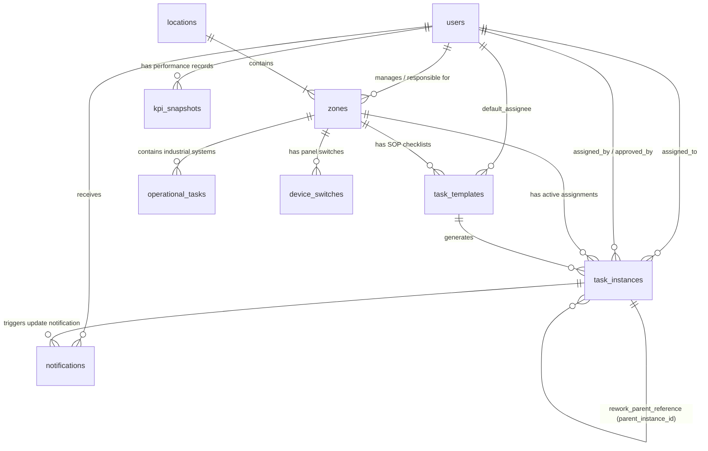

# توثيق وهيكلة قاعدة بيانات نظام التشغيل والجودة (Naris Ops Database Documentation)

نظام **Naris Ops** (أو العلامة التجارية **Professor**) هو نظام رقمي متكامل مخصص لإدارة عمليات النظافة اليومية، الإشراف على الجودة وتطبيق معايير التشغيل القياسية (**SOP**). يعتمد النظام على بيئة العمل السحابية **Firebase (Firestore Database & Storage)** لحفظ وتتبع البيانات والوسائط في الوقت الفعلي.

يمثل هذا الملف المرجع الشامل والوحيد لقاعدة البيانات والهندسة التقنية للنظام.

---

## 1. نماذج ومجموعات البيانات بالتفصيل (Collections / Models)

تتألف قاعدة البيانات في **Firestore** من 9 مجموعات رئيسية (Collections). وفيما يلي تفصيل دقيق لكل مجموعة، حقولها، ومثال حي لقيمها:

### 1.1 مجموعة المستخدمين (`users`)
*   **الهدف**: تمثيل الحسابات الشخصية والملفات المهنية لجميع الموظفين (مدراء، مشرفين، منظفين) وإدارة فترات عملهم (Shifts).
*   **الحقول**:

| اسم الحقل | النوع (Type) | إجباري/اختياري | الوصف والهدف | مثال قيمة |
| :--- | :--- | :--- | :--- | :--- |
| `id` | `String` | إجباري (مفتاح رئيسي) | معرف المستخدم الفريد في النظام (يبدأ بـ `p_`) | `"p_93ka81la2"` |
| `full_name` | `String` | إجباري | الاسم الرباعي للموظف باللغة العربية | `"عفاف محمود علي"` |
| `username` | `String` | إجباري | اسم مستخدم فريد لعملية تسجيل الدخول | `"afaf_cleaner"` |
| `role` | `String (Enum)` | إجباري | الصلاحية الوظيفية (`'admin'` \| `'supervisor'` \| `'cleaner'`) | `"cleaner"` |
| `phone` | `String` | اختياري | رقم الهاتف المحمول للتواصل | `"+201012345678"` |
| `avatar_url` | `String` | اختياري | رابط الصورة الشخصية للموظف | `"https://lh3.googleusercontent.com/..."` |
| `is_active` | `Boolean` | إجباري | حالة تفعيل الحساب في النظام ومسموح له بالدخول | `true` |
| `shift_start` | `String` | اختياري | وقت بداية الوردية (تنسيق 24 ساعة) | `"08:00"` |
| `shift_end` | `String` | اختياري | وقت نهاية الوردية (تنسيق 24 ساعة) | `"16:00"` |
| `work_days` | `Array of Strings` | اختياري | أيام العمل الأسبوعية للموظف | `["الأحد", "الإثنين", "الثلاثاء"]` |
| `created_at` | `String` | اختياري | تاريخ ووقت إنشاء الحساب (ISO 8601) | `"2026-07-13T10:00:00.000Z"` |

---

### 1.2 مجموعة المواقع الرئيسية (`locations`)
*   **الهدف**: تمثيل الفروع أو المقرات الجغرافية التي يتم تشغيل عمليات الجودة بها.
*   **الحقول**:

| اسم الحقل | النوع (Type) | إجباري/اختياري | الوصف والهدف | مثال قيمة |
| :--- | :--- | :--- | :--- | :--- |
| `id` | `String` | إجباري (مفتاح رئيسي) | معرف المقر الفريد (يبدأ بـ `l_` أو معرف مخصص) | `"hq_cairo"` |
| `name` | `String` | إجباري | الاسم التعريفي للفرع أو المقر | `"المقر الرئيسي - القاهرة"` |
| `address` | `String` | اختياري | العنوان التفصيلي للموقع الجغرافي | `"القرية الذكية، مبنى 12، الجيزة"` |
| `created_at` | `String` | اختياري | تاريخ ووقت إضافة المقر في النظام | `"2026-07-13T10:00:00.000Z"` |

---

### 1.3 مجموعة المناطق الداخلية (`zones`)
*   **الهدف**: تقسيم كل مقر رئيسي إلى مناطق فرعية مستقلة (مثل الاستقبال، غرف الاجتماعات، الممرات) لربطها بالمسؤولين والمهام.
*   **الحقول**:

| اسم الحقل | النوع (Type) | إجباري/اختياري | الوصف والهدف | مثال قيمة |
| :--- | :--- | :--- | :--- | :--- |
| `id` | `String` | إجباري (مفتاح رئيسي) | معرف المنطقة الفريد (يبدأ بـ `z_`) | `"z_reception"` |
| `location_id` | `String` | إجباري | معرف المقر الرئيسي المرتبط بهذه المنطقة (مفتاح أجنبي) | `"hq_cairo"` |
| `name` | `String` | إجباري | اسم المنطقة باللغة العربية | `"منطقة الاستقبال والانتظار"` |
| `code` | `String` | اختياري | كود تشغيلي مختصر للمنطقة | `"SOP_REC01"` |
| `floor` | `String` | اختياري | الطابق الواقعة به المنطقة | `"الدور الأرضي"` |
| `responsible_employee_id` | `String` | اختياري | معرف الموظف المسؤول بشكل أساسي عنها (مفتاح أجنبي) | `"p_93ka81la2"` |
| `cover_image_url` | `String` | اختياري | صورة توضيحية لقبل أو بعد شكل المنطقة الافتراضي | `"https://images.unsplash.com/..."` |
| `sort_order` | `Number` | اختياري | ترتيب عرض المنطقة في لوحة التحكم والتطبيق | `1` |
| `created_at` | `String` | اختياري | تاريخ ووقت إنشاء المنطقة | `"2026-07-13T10:00:00.000Z"` |

---

### 1.4 مجموعة قوالب المهام القياسية (`task_templates`)
*   **الهدف**: تعريف قواعد الـ **SOP** الأساسية؛ حيث تحتوي على المتطلبات ونقاط الفحص الثابتة التي تُستنسخ منها مهام التشغيل اليومية.
*   **الحقول**:

| اسم الحقل | النوع (Type) | إجباري/اختياري | الوصف والهدف | مثال قيمة |
| :--- | :--- | :--- | :--- | :--- |
| `id` | `String` | إجباري (مفتاح رئيسي) | معرف القالب الفريد (يبدأ بـ `t_`) | `"t_floor_clean"` |
| `zone_id` | `String` | إجباري | معرف المنطقة التي ستُنفذ بها المهمة (مفتاح أجنبي) | `"z_reception"` |
| `task_code` | `String` | إجباري | رمز إجراء التشغيل القياسي (SOP Code) | `"SOP_CLE01"` |
| `title` | `String` | إجباري | العنوان الواضح للمهمة | `"تنظيف وتطهير الأرضيات الرخامية"` |
| `description` | `String` | اختياري | الخطوات العملية بالتفصيل لإتمام المهمة | `"استخدام المطهر المعتمد والمسح بالاتجاهين"` |
| `goal` | `String` | اختياري | الهدف أو النتيجة المتوقعة ومقياس النجاح | `"الحصول على سطح لامع خالٍ من البقع والروائح"` |
| `category` | `String (Enum)` | إجباري | تصنيف المهمة (`'تشغيل'` \| `'نظافة'` \| `'صيانة'` \| `'سلامة'` \| `'جودة'` \| `'تجهيز'`) | `"نظافة"` |
| `tools_required` | `String` | اختياري | الأدوات والمواد الكيميائية اللازمة للتنفيذ | `"ممسحة مايكروفايبر، مطهر رقم 4، ماء دافئ"` |
| `frequency` | `String` | إجباري | دورية التكرار (`"يومي"` \| `"أسبوعي"` \| `"مرتين أسبوعيا"` \| `"شهري"`) | `"يومي"` |
| `recurrence_days` | `Array of Strings` | اختياري | الأيام المحددة لتكرار المهمة (إذا لم تكن يومية) | `["السبت", "الثلاثاء"]` |
| `estimated_duration_minutes` | `Number` | اختياري | الوقت المتوقع الكافي لإنجاز المهمة بالدقائق | `20` |
| `scheduled_time` | `String` | اختياري | الوقت المستهدف لإنجاز المهمة (تنسيق HH:MM) | `"09:30"` |
| `requires_photo_before`| `Boolean` | إجباري | هل يتوجب التقاط صورة إثبات حالة "قبل العمل"؟ | `true` |
| `requires_photo_after` | `Boolean` | إجباري | هل يتوجب التقاط صورة إثبات جودة "بعد العمل"؟ | `true` |
| `requires_supervisor_approval` | `Boolean`| إجباري | هل تحتاج المهمة لاعتماد ومراجعة يدوية من المشرف؟| `true` |
| `requires_gps` | `Boolean` | إجباري | هل تتطلب مطابقة الموقع الجغرافي؟ | `false` |
| `requires_signature` | `Boolean` | إجباري | هل تتطلب توقيع الموظف الرقمي عند التسليم؟ | `true` |
| `is_reopenable` | `Boolean` | إجباري | هل يمكن إعادة فتح المهمة بعد إغلاقها؟ | `false` |
| `auto_escalate_if_late` | `Boolean` | إجباري | تصعيد المهمة تلقائياً للمدير في حال التأخر عن الموعد | `true` |
| `default_assignee_id` | `String` | اختياري | معرف الموظف الافتراضي المسندة له المهمة (مفتاح أجنبي) | `"p_93ka81la2"` |
| `is_active` | `Boolean` | إجباري | حالة تفعيل القالب في النظام لتوليد المهام منه | `true` |
| `created_at` | `String` | اختياري | تاريخ ووقت إنشاء قالب المهمة | `"2026-07-13T10:00:00.000Z"` |
| `updated_at` | `String` | اختياري | تاريخ ووقت آخر تعديل على القالب | `"2026-07-13T12:30:00.000Z"` |

---

### 1.5 مجموعة المهام التشغيلية الحالية (`task_instances`)
*   **الهدف**: تمثل "المهام الحية" الفردية الصادرة ليوم محدد، والمسؤولة عن تتبع حالة التنفيذ والصور والتقييمات الخاصة بالموظف والمسؤول.
*   **الحقول**:

| اسم الحقل | النوع (Type) | إجباري/اختياري | الوصف والهدف | مثال قيمة |
| :--- | :--- | :--- | :--- | :--- |
| `id` | `String` | إجباري (مفتاح رئيسي) | معرف المهمة الفريد لليوم (يبدأ بـ `ti_`) | `"ti_ab73k9d91"` |
| `template_id` | `String` | اختياري | معرف قالب الـ SOP المشتقة منه المهمة (مفتاح أجنبي) | `"t_floor_clean"` |
| `zone_id` | `String` | إجباري | معرف المنطقة التابعة لها المهمة (مفتاح أجنبي) | `"z_reception"` |
| `assigned_to` | `String` | إجباري | معرف الموظف المنفذ المسندة إليه (مفتاح أجنبي للمستخدم) | `"p_93ka81la2"` |
| `assigned_by` | `String` | اختياري | معرف المشرف أو المدير الذي أسند المهمة (مفتاح أجنبي) | `"p_admin"` |
| `task_type` | `String (Enum)` | إجباري | تصنيف نوع التشغيل (`'recurring'` مجدولة \| `'one_time'` فورية \| `'rework'` إعادة عمل) | `"recurring"` |
| `parent_instance_id` | `String` | اختياري | في مهام إعادة التنظيف، يربط المهمة بالمهمة الأصلية المرفوضة | `"ti_old_rejected_92"` |
| `title` | `String` | إجباري | عنوان المهمة كما سيظهر للمنظف | `"تنظيف وتطهير الأرضيات الرخامية"` |
| `description` | `String` | اختياري | شرح وتفاصيل العمل المطلوبة | `"استخدام المطهر المعتمد والمسح بالاتجاهين"` |
| `due_date` | `String` | إجباري | تاريخ الاستحقاق الفعلي (تنسيق YYYY-MM-DD) | `"2026-07-13"` |
| `due_time` | `String` | اختياري | وقت الاستحقاق الأقصى للتسليم (تنسيق HH:MM) | `"09:30"` |
| `status` | `String (Enum)` | إجباري | حالة المهمة الحالية (`'pending'` \| `'in_progress'` \| `'completed'` \| `'late'` \| `'rejected'` \| `'escalated'`) | `"completed"` |
| `requires_photo_before`| `Boolean` | اختياري | هل تحتاج التقاط صورة "قبل" التنفيذ؟ | `true` |
| `requires_photo_after` | `Boolean` | اختياري | هل تحتاج التقاط صورة "بعد" التنفيذ؟ | `true` |
| `photo_before_url` | `String` | اختياري | رابط الصورة (في Firebase Storage أو Base64 المباشر) | `"data:image/jpeg;base64,..."` أو رابط URL |
| `photo_after_url` | `String` | اختياري | رابط الصورة (في Firebase Storage أو Base64 المباشر) | `"https://firebasestorage..."` |
| `photo_after_taken_at` | `String` | اختياري | توقيت التقاط صورة "بعد العمل" بالتفصيل | `"2026-07-13T09:22:15.102Z"` |
| `employee_signature_url`| `String` | اختياري | رابط صورة التوقيع الرقمي للمنظف عند التسليم | `"data:image/png;base64,..."` |
| `employee_notes` | `String` | اختياري | ملاحظات يكتبها المنظف أثناء أو عند تسليم العمل | `"تم استخدام مواد النظافة البديلة لنفاد الصنف 4"` |
| `supervisor_approved` | `Boolean` | إجباري | هل حظيت المهمة بموافقة المشرف؟ | `true` |
| `supervisor_approved_by`| `String` | اختياري | معرف المشرف الذي قام باعتماد أو مراجعة المهمة | `"p_supervisor_cairo"` |
| `supervisor_approved_at`| `String` | اختياري | تاريخ ووقت المراجعة والاعتماد الفعلي | `"2026-07-13T09:40:00.000Z"` |
| `supervisor_notes` | `String` | اختياري | ملاحظات المشرف حول الجودة المنجزة للعمل | `"عمل ممتاز، الالتزام بالوقت كان رائعاً"` |
| `quality_grade` | `String (Enum)` | اختياري | تقييم جودة تسليم المهمة من قبل المشرف (`'A'` \| `'B'` \| `'C'`) | `"A"` |
| `started_at` | `String` | اختياري | تاريخ ووقت ضغط زر "البدء" والتقاط صورة "قبل" | `"2026-07-13T09:02:10.000Z"` |
| `completed_at` | `String` | اختياري | تاريخ ووقت ضغط زر "التسليم" والتقاط صورة "بعد" | `"2026-07-13T09:22:15.000Z"` |
| `delay_minutes` | `Number` | اختياري | مدة التأخر الفعلي بالدقائق عن وقت الاستحقاق `due_time` | `0` |
| `created_at` | `String` | اختياري | تاريخ إنشاء وتوليد المهمة داخل المستند | `"2026-07-13T00:05:00.000Z"` |
| `updated_at` | `String` | اختياري | تاريخ آخر تحديث لحالة أو بيانات هذه المهمة | `"2026-07-13T09:40:00.000Z"` |

---

### 1.6 مجموعة المهام التشغيلية الدورية المجدولة (`operational_tasks`)
*   **الهدف**: إدارة ومراقبة لوحات التشغيل والخدمات الفنية المستمرة المرتبطة بأنظمة مثل تشغيل وإطفاء الأجهزة والإنارة طبقاً لجداول زمنية محددة.
*   **الحقول**:

| اسم الحقل | النوع (Type) | إجباري/اختياري | الوصف والهدف | مثال قيمة |
| :--- | :--- | :--- | :--- | :--- |
| `id` | `String` | إجباري (مفتاح رئيسي) | معرف المهمة الفنية الفريد | `"op_air_cond"` |
| `zone_id` | `String` | إجباري | معرف المنطقة المحتوية على الأجهزة (مفتاح أجنبي) | `"z_reception"` |
| `title` | `String` | إجباري | اسم النظام أو التكليف التشغيلي | `"جدولة تشغيل المكيفات المركزية"` |
| `description` | `String` | اختياري | تفاصيل فنية لتعليمات التشغيل والإغلاق | `"يتم تشغيل الـ Chiller في فترات التواجد وإطفائه ليلاً"` |
| `schedule_windows` | `Array of Objects` | اختياري | فترات العمل اليومي والأوضاع المستهدفة | `[{"from": "08:00", "to": "18:00", "mode": "Cooling"}]` |
| `responsible_employee_id`| `String` | اختياري | الموظف المسؤول التقني عن التشغيل (مفتاح أجنبي) | `"p_93ka81la2"` |
| `switch_codes` | `Array of Strings` | اختياري | أكواد المفاتيح الكهربائية المرتبطة بالجهاز في لوحة التحكم| `["SW_AC_REC_01", "SW_AC_REC_02"]` |
| `is_active` | `Boolean` | إجباري | حالة فاعلية الخدمة وجدول التشغيل | `true` |

---

### 1.7 مجموعة التنبيهات والرسائل الإدارية (`notifications`)
*   **الهدف**: تزويد المشرفين والمنظفين بإشعارات فورية عن تعيين المهام، اقتراب موعد الاستحقاق، التقييم، أو طلبات إعادة العمل.
*   **الحقول**:

| اسم الحقل | النوع (Type) | إجباري/اختياري | الوصف والهدف | مثال قيمة |
| :--- | :--- | :--- | :--- | :--- |
| `id` | `String` | إجباري (مفتاح رئيسي) | معرف التنبيه الفريد (يبدأ بـ `n_`) | `"n_72js93ma8"` |
| `recipient_id` | `String` | إجباري | معرف المستخدم المستلم للإشعار (مفتاح أجنبي) | `"p_93ka81la2"` |
| `type` | `String (Enum)` | إجباري | نوع الإشعار (`'task_assigned'` \| `'task_due_soon'` \| `'task_late'` \| `'task_approved'` \| `'task_rejected'` \| `'rework_requested'`) | `"task_rejected"` |
| `title` | `String` | إجباري | عنوان التنبيه العريض باللغة العربية | `"تنبيه: تم رفض المهمة ⚠️"` |
| `body` | `String` | اختياري | تفاصيل رسالة التنبيه وسبب الإرسال | `"تم رفض مهمة تنظيف الممر بسبب عدم جودة تلميع النوافذ"` |
| `related_task_instance_id`| `String` | اختياري | معرف المهمة ذات الصلة بالتنبيه لفتحها مباشرة | `"ti_ab73k9d91"` |
| `is_read` | `Boolean` | إجباري | هل قام الموظف بقراءة الإشعار أم لا؟ | `false` |
| `created_at` | `String` | اختياري | تاريخ ووقت إرسال التنبيه | `"2026-07-13T09:25:00.000Z"` |

---

### 1.8 مجموعة مفاتيح الأجهزة والتحكم الكهربائي (`device_switches`)
*   **الهدف**: ربط المفاتيح والمقابس الكهربائية بالمناطق الجغرافية لتسهيل تحكم ومراقبة الأجهزة من قبل الموظفين.
*   **الحقول**:

| اسم الحقل | النوع (Type) | إجباري/اختياري | الوصف والهدف | مثال قيمة |
| :--- | :--- | :--- | :--- | :--- |
| `id` | `String` | إجباري (مفتاح رئيسي) | معرف المفتاح الفريد | `"sw_1"` |
| `code` | `String` | إجباري | الكود الفني للمفتاح المكتوب على اللوحة الكهربائية | `"SW_AC_REC_01"` |
| `label` | `String` | إجباري | الاسم الوصفي للمفتاح للتسهيل على العامل | `"تكييف الاستقبال الرئيسي"` |
| `zone_id` | `String` | إجباري | معرف المنطقة الواقع بها هذا المفتاح (مفتاح أجنبي) | `"z_reception"` |
| `panel_location` | `String` | اختياري | مكان اللوحة الكهربائية الحاوية للمفتاح | `"جدار غرفة التجهيزات الخلفي"` |

---

### 1.9 مجموعة لقطات مؤشرات الأداء (`kpi_snapshots`)
*   **الهدف**: تخزين نتائج تقييم أداء الموظفين المحسوبة بشكل دوري (يومي، أسبوعي، شهري) لضمان سرعة عرض الإحصائيات وبناء لوحات التحكم للمدراء والمنظفين دون حسابات ثقيلة متكررة.
*   **الحقول**:

| اسم الحقل | النوع (Type) | إجباري/اختياري | الوصف والهدف | مثال قيمة |
| :--- | :--- | :--- | :--- | :--- |
| `id` | `String` | إجباري (مفتاح رئيسي) | معرف لقطة الأداء الفريد | `"kpi_p2_weekly_28"` |
| `profile_id` | `String` | إجباري | معرف الموظف المرتبط بلقطة الأداء (مفتاح أجنبي) | `"p_93ka81la2"` |
| `period_type` | `String (Enum)` | إجباري | فترة القياس المستهدفة (`'daily'` \| `'weekly'` \| `'monthly'`) | `"weekly"` |
| `period_start` | `String` | إجباري | بداية الفترة الزمنية (تنسيق YYYY-MM-DD) | `"2026-07-12"` |
| `period_end` | `String` | إجباري | نهاية الفترة الزمنية (تنسيق YYYY-MM-DD) | `"2026-07-18"` |
| `tasks_assigned` | `Number` | إجباري | إجمالي عدد المهام المسندة للموظف خلال تلك الفترة | `15` |
| `tasks_completed_on_time`| `Number` | إجباري | عدد المهام التي تم إنجازها وتسليمها قبل موعد الاستحقاق | `12` |
| `tasks_late` | `Number` | إجباري | عدد المهام التي سلمت متأخرة أو لم تسلم وانتهى وقتها | `2` |
| `tasks_reworked` | `Number` | إجباري | عدد المرات التي رُفضت فيها مهامه وتطلبت إعادة عمل | `1` |
| `compliance_rate` | `Number` | إجباري | نسبة الالتزام الإجمالية المئوية (من 0 إلى 100) | `80` |
| `avg_execution_time_minutes`| `Number` | إجباري | متوسط وقت التنفيذ الفعلي من البدء حتى التسليم بالدقائق| `18.5` |
| `quality_score` | `Number` | إجباري | نتيجة قياس نقاط الجودة الممنوحة من تقييم المشرفين (A, B, C) | `92` |
| `supervisor_rating` | `Number` | إجباري | متوسط التقييم بالنجوم الممنوح من المشرفين للموظف | `4.7` |
| `computed_at` | `String` | اختياري | وقت حساب ومزامنة هذه اللقطة بشكل دقيق | `"2026-07-13T23:59:00.000Z"` |

---

## 2. علاقات الكيانات في قاعدة البيانات (Entity Relationships)

يتبع نظام **Naris Ops** العلاقات البنائية التالية لضمان ترابط البيانات بشكل وثيق:

*   **الموقع (`locations`) والمناطق (`zones`)**: علاقة **راس بأطراف (One-to-Many)**. كل موقع جغرافي يحتوي على منطقة واحدة أو أكثر، بينما تنتمي المنطقة لموقع واحد فقط عبر حقل `location_id`.
*   **المستخدم (`users`) والمنطقة (`zones`)**: علاقة **رأس بأطراف**؛ حيث يمكن تعيين مستخدم واحد كمسؤول تشغيلي أساسي عن عدة مناطق من خلال حقل `responsible_employee_id`.
*   **المنطقة (`zones`) وقوالب المهام (`task_templates`)**: علاقة **رأس بأطراف**. كل منطقة ترتبط بمجموعة من القوالب التي توضح خطوات الـ SOP الخاصة بتشغيلها ونظافتها عبر حقل `zone_id`.
*   **المستخدم وقالب المهام (`task_templates`)**: علاقة **رأس بأطراف**؛ حيث يُعين مستخدم كمنفذ افتراضي تلقائي (`default_assignee_id`) لتنفيذ المهام المولدة من هذا القالب.
*   **قالب المهام والمهام التشغيلية الحية (`task_instances`)**: علاقة **رأس بأطراف**؛ حيث يمكن لقالب SOP واحد أن ينتج العديد من المهام اليومية الفردية عبر الأيام من خلال حقل `template_id`.
*   **المنطقة والمهام التشغيلية (`task_instances`)**: علاقة **رأس بأطراف**؛ ترتبط كل مهمة بمنطقة محددة عبر حقل `zone_id`.
*   **الموظف والمهام التشغيلية (`task_instances`)**: علاقتان من نوع **رأس بأطراف**:
    *   `assigned_to`: الموظف (المنظف) المكلف الفعلي بالتنفيذ.
    *   `assigned_by`: المشرف أو المسؤول الفعلي الذي قام بالجدولة أو المتابعة.
*   **مراجعة المشرف والمهام التشغيلية**: علاقة **رأس بأطراف**؛ يسجل حقل `supervisor_approved_by` معرف المشرف الذي راجع وقيم المهمة.
*   **المهمة الأصلية ومهمة إعادة التنظيف (`rework_task`)**: علاقة **رأس بأطراف ذاتية (Self-Referencing)**؛ حيث يتم ربط مهمة إعادة العمل بالمهمة الأصلية المرفوضة عبر حقل `parent_instance_id`.
*   **المستخدم ومؤشرات الأداء (`kpi_snapshots`)**: علاقة **رأس بأطراف**؛ حيث يملك الموظف عدة سجلات ولقطات إحصائية أسبوعية أو شهرية عبر حقل `profile_id`.
*   **المستخدم والإشعارات (`notifications`)**: علاقة **رأس بأطراف**؛ حيث يملك المستخدم صندوق إشعارات مخصص يستقبل به رسائل عبر حقل `recipient_id`.
*   **المنطقة ومفاتيح التحكم (`device_switches`)**: علاقة **رأس بأطراف**؛ ترتبط المفاتيح بمنطقة جغرافية معينة لتسهيل المراقبة عبر حقل `zone_id`.

---

## 3. دورة حياة تدفق البيانات (Data Flow Lifecycle)

يمر تدفق البيانات في النظام منذ بداية التكليف بالـ SOP وحتى الاعتماد النهائي بالخطوات التالية:

```
[توليد المهام تلقائياً أو يدوياً] ──> [حالة معلقة Pending] ──> [التقاط صورة "قبل" والبدء] ──> [حالة جاري العمل In Progress] 
                                                                                                      │
[اعتماد الجودة ولقطة الأداء] <── [اعتماد المشرف Approved] <── [التقاط صورة "بعد" والتسليم] <── [حالة مكتملة Completed]
       │                                                                                              │
       └─── [طلب إعادة التنظيف] ──> [توليد مهمة Rework جديدة] ──> [حالة مرفوضة Rejected] <─────────────┘
```

### الخطوة 1: جدولة وتوليد المهام
1.  **المسار التلقائي (Auto-Generation)**: في بداية اليوم، وعند طلب المنظف أو المشرف لواجهة المهام، يقوم السيرفر/التطبيق بالتحقق من جدول مهام اليوم التاريخي (`due_date == today`). في حال وجود قوالب مهام (`task_templates`) نشطة تتطابق دوريتها مع اليوم الحالي (يومياً، أو تطابق اليوم العربي مع `recurrence_days`) وليس لها مهمة تشغيلية تم إنشاؤها بالفعل لليوم، يتم توليد مستند `task_instance` بوضعية `'pending'`.
2.  **المسار اليدوي (Manual-Creation)**: يستطيع المشرف أو المدير من لوحة التحكم إنشاء مهمة تشغيلية فورية مباشرة من نوع `'one_time'` وتعيينها لمنظف ما لمنطقة ما، وتُحفظ كـ `task_instance` فوراً بوضعية `'pending'`.
3.  **تنبيه الإسناد**: فور إنشاء مستند المهمة، يتم إضافة مستند في مجموعة `notifications` لتبليغ الموظف المستهدف بالإسناد.

### الخطوة 2: بدء التنفيذ (قبل العمل)
1.  يقوم الموظف (المنظف) بفتح لوحة مهامه اليومية، وتحديد المهمة المعلقة.
2.  عند الضغط على زر **"بدء العمل"**:
    *   إذا كان القالب يتطلب صورة قبل العمل (`requires_photo_before: true`)، يتم فتح الكاميرا في جهاز الموظف لالتقاط صورة إثبات الحالة الأصلية.
    *   يتم رفع الصورة (عبر خوارزمية الرفع المذكورة أدناه) والحصول على الرابط لتخزينه في حقل `photo_before_url`.
    *   يتم تحديث حقل الحالة `status` إلى `'in_progress'`.
    *   يتم تسجيل توقيت بدء العمل الفعلي في حقل `started_at`.

### الخطوة 3: تسليم العمل (بعد العمل)
1.  عند انتهاء الموظف من التنظيف والتعقيم، يقوم بالضغط على زر **"إرسال للتسليم"**:
    *   إذا تطلبت المهمة صورة جودة بعد العمل (`requires_photo_after: true`)، يلتقط الموظف الصورة التي تظهر نتيجة النظافة الرائعة.
    *   يتم رفع الصورة وحفظ الرابط في حقل `photo_after_url` وتوثيق توقيت التقاط الصورة في حقل `photo_after_taken_at`.
    *   إذا كان النظام مهيأً للتوقيع الرقمي، يوقع الموظف رقمياً على الشاشة ويتم تخزين التوقيع كـ Base64 في حقل `employee_signature_url`.
    *   يمكن للموظف تدوين أي عوائق في حقل `employee_notes`.
    *   تتحول حالة المهمة `status` تلقائياً إلى `'completed'`.
    *   يتم توثيق توقيت التسليم الفعلي في حقل `completed_at` ويُحسب الفارق الزمني عن موعد الاستحقاق لتسجيل دقائق التأخير في حقل `delay_minutes`.

### الخطوة 4: المراجعة والتقييم من قبل المشرف
تظهر المهمة المكتملة في لوحة تحكم المشرف والمدير ليقوما بمراجعة الصور والملاحظات، ويملك المشرف خيارين للمراجعة:

*   **الخيار أ: الاعتماد والقبول (Approve)**
    1. يضغط المشرف على زر "اعتماد"، ويختار مستوى جودة التسليم (`'A'` \| `'B'` \| `'C'`) ويدون ملاحظاته في `supervisor_notes`.
    2. يتم تحديث مستند المهمة ليكون `supervisor_approved: true` وتوثيق بيانات المعتمد وتوقيت الاعتماد في `supervisor_approved_by` و `supervisor_approved_at`.
    3. يرسل النظام إشعاراً سعيداً للمنظف باعتماد المهمة بنجاح، ويتم إدراج النتائج ضمن حساب مؤشرات أدائه القادم (`kpi_snapshots`).

*   **الخيار ب: الرفض وإعادة التنظيف (Reject / Rework)**
    1. يضغط المشرف على زر "رفض وإعادة العمل"، ويدون سبب الرفض والتعليمات المطلوبة في `supervisor_notes`.
    2. يتم تحديث المهمة الأصلية لتتحول حالتها `status` إلى `'rejected'` وتصبح `supervisor_approved: false`.
    3. **توليد مهمة إعادة عمل ذكية**: يقوم النظام تلقائياً بإنشاء مستند مهمة جديد تماماً في مجموعة `task_instances` بالمواصفات التالية:
        *   كود فريد مسبوق بـ `ti_rework_`.
        *   نوع المهمة `task_type` هو `'rework'`.
        *   تتطابق حقول المنطقة والعنوان والمنظف مع المهمة الأصلية.
        *   تثبيت حقل `parent_instance_id` ليشير إلى معرف المهمة الأصلية المرفوضة لربط التسلسل التاريخي.
        *   توضع الحالة الافتراضية للمهمة الجديدة كـ `'pending'` مع إشعار للمنظف بوجود مهمة إعادة عمل مستعجلة للمنطقة.

---

## 4. مسار معالجة ورفع الصور (Photo Pipeline & CORS Diagnostics)

تم تزويد نظام **Naris Ops** بمسار متطور ومرن للغاية للتعامل مع الصور وحل مشكلات الاتصال وسياسات أمن المتصفحات (**CORS**) لضمان استمرارية العمل دون توقف الكاميرا الميدانية:

### 4.1 خط معالجة الصورة في المتصفح (Image Processing Pipeline)
1.  **الالتقاط والضغط**: تلتقط الكاميرا الميدانية الصورة بدقة عالية، وتجنباً للبطء في الشبكة واستهلاك المساحات، يتم إرسال الصورة مصفوفة Base64 إلى دالة الضغط والتحجيم `compressImage` لتصغير أبعادها إلى أقصى حد يبلغ $800 \times 800$ بكسل وبمعدل جودة جودة $60\%$ بصيغة `image/jpeg`.
2.  **خيار الرفع الافتراضي (Firebase Storage)**:
    *   يحاول النظام رفع ملف الصورة المضغوطة بصيغة مصفوفة ترميز النصية `data_url` إلى خوادم **Firebase Storage** على المسار الديناميكي التالي:
        `task-photos/{zone_id}/{task_instance_id}/before.jpg` (أو `after.jpg`).
    *   عند نجاح الرفع، يتم استصدار رابط تنزيل مباشر عام موثق وصالح للوصول (`downloadUrl`) وتخزينه في مستند Firestore.
3.  **خيار التعافي الذاتي للصور (CORS Self-Healing / Base64 Mode)**:
    *   **المشكلة**: أحياناً تعترض المتصفحات عمليات الرفع وتمنعها بسبب تضارب سياسات تبادل الموارد بين النطاقات المختلفة (CORS policy) في بيئات المعاينة والتطوير مثل `ai.studio` أو `localhost`.
    *   **الحل الذكي**: في حال كشف النظام لوجود خطأ أو تحذير في اتصال خوادم الـ Storage، أو عند تفعيل هذا النمط يدوياً من لوحة تحكم المشرف، يقوم النظام فوراً وبطريقة شفافة بالتخلي عن الرفع إلى Firebase Storage، وحفظ البيانات النصية المضغوطة للصورة مباشرة كـ Base64 داخل مستند Firestore في حقل رابط الصورة نفسه (`photo_before_url` أو `photo_after_url`).
    *   بفضل الضغط العالي المعتمد، يقل حجم الصورة عن **30 كيلوبايت**، مما يسمح بحفظها بشكل فائق السرعة داخل قاعدة بيانات Firestore دون تجاوز الحد الأقصى للمستند (1 ميجابايت)، ويضمن ظهور الصور فوراً لجميع المشرفين دون أي مشاكل فنية وبأعلى مستوى اعتمادية واستقرار.

---

## 5. الطوابع الزمنية المستخدمة ومعانيها (Database Timestamps)

تستخدم قاعدة البيانات مجموعة من الطوابع الزمنية الدقيقة بنظام الـ ISO لتتبع توقيتات الأداء والامتثال لمعايير الـ SOP:

*   `created_at`: يسجل وقت وتاريخ إنشاء المستند (الحساب، المنطقة، قالب المهمة، المهمة التشغيلية، الإشعار). يفيد في استخراج تواريخ البدايات والجدولة.
*   `updated_at`: يوثق وقت وتاريخ إجراء آخر عملية تعديل على محتويات المستند الحالي لضمان مزامنة التغييرات وتتبع النسخ.
*   `started_at`: طابع زمني حاسم يسجل اللحظة التي ضغط فيها المنظف على زر "بدء العمل" والتقاط صورة "قبل". يفيد في حساب سرعة استجابة العامل لبدء الـ SOP.
*   `completed_at`: يسجل توقيت تسليم الموظف للعمل الفعلي والتقاط صورة "بعد". يُقارن مع `due_time` لتحديد نسبة الالتزام والتأخير.
*   `photo_after_taken_at`: طابع زمني خاص يوثق بالملي ثانية لحظة توليد وصناعة الصورة النهائية بعد النظافة للتأكد من عدم استخدام صور قديمة من المعرض.
*   `supervisor_approved_at`: يسجل اللحظة التاريخية لاعتماد المشرف للجودة، ويقاس الفارق بينه وبين `completed_at` لمعرفة سرعة استجابة الإدارة للمراجعة.
*   `computed_at`: طابع حساب مؤشرات الأداء، يسجل بدقة وقت قيام محرك الإحصائيات بتشغيل الخوارزميات وصياغة التقييمات في لقطة الأداء لضمان حداثة البيانات المعروضة.

---

## 6. حالات المهمة والمسؤول عن تغييرها (Task Status State Machine)

تتحكم الأدوار التشغيلية المختلفة في حالة مستند المهمة عبر دورة عملها:

| الحالة (Status) | معنى الحالة | المسؤول عن الانتقال إليها | الإجراء التقني المترتب عليها |
| :--- | :--- | :--- | :--- |
| **`pending` (معلقة)** | المهمة مجدولة وتنتظر بدء العمل من المنظف اليوم. | النظام تلقائياً عند الجدولة، أو المشرف يدوياً عند التكليف الفوري. | تظهر في لوحة مهام المنظف اليومية باللون الرمادي ومصحوبة بإشعار إسناد. |
| **`in_progress` (جاري التنفيذ)** | المنظف باشر العمل الفعلي في المنطقة. | الموظف (المنظف) بالضغط على زر "بدء العمل". | يتم تسجيل `started_at` والتقاط صورة "قبل العمل" الاختيارية/الإجبارية. |
| **`completed` (مكتملة ومسلمة)** | تم الانتهاء من العمل وتنتظر الاعتماد والمراجعة. | الموظف (المنظف) بالضغط على زر "إرسال للتسليم". | يسجل `completed_at` وصورة "بعد"، ويحسب `delay_minutes`؛ ترسل للمشرف للمراجعة. |
| **`rejected` (مرفوضة)** | لم تطابق الجودة المطلوبة في معيار الـ SOP. | المشرف أو المدير بالضغط على زر "رفض وإعادة العمل". | يتم توثيق سبب الرفض وتوليد مستند مهمة إعادة عمل (`rework`) فرعي جديد مستقل. |
| **`late` (متأخرة)** | انتهى وقت التسليم ولم يتم إتمام المهمة في موعدها. | خوارزميات فحص الوقت الذاتية في التطبيق. | يظهر مؤشر التأخر باللون الأحمر وتُحتسب كعامل منخفض في حسابات مؤشرات الالتزام. |
| **`escalated` (مصعدة)** | تأخرت المهمة طويلاً دون استجابة وتتطلب تدخل الإدارة. | النظام تلقائياً بناءً على تفعيل خيار تصعيد القالب الافتراضي. | إشعار عاجل لمدير العمليات للتدخل ومعرفة أسباب تأخر تشغيل المنطقة. |

---

## 7. صلاحيات الأدوار على مستوى قاعدة البيانات (RBAC Permissions)

يمتلك النظام نموذج تحكم قوي بالوصول يستند إلى الأدوار المهنية (**Role-Based Access Control**):

### 7.1 دور مدير العمليات والجودة (`admin`)
*   **لوحة التحكم**: لوحة الإدارة المتكاملة (Admin Panel).
*   **صلاحيات القراءة والكتابة في Firestore**:
    *   تحكم كامل (قراءة، إنشاء، تعديل، حذف) على جميع المستخدمين (`users`) والمواقع والفرع (`locations`) والمناطق (`zones`).
    *   إدارة قوالب التشغيل والـ SOP كاملاً (`task_templates`).
    *   قراءة وتعديل وحذف ومراقبة جميع الحالات الخاصة بالمهام اليومية الفردية لجميع الموظفين (`task_instances`).
    *   تهيئة الأجهزة والتحكم الكهربائي الدورية ومراقبة التنبيهات وإعادة تصفير وتهيئة قاعدة البيانات كاملاً عند اللزوم ومراقبة جودتها.

### 7.2 دور المشرف والمراقب الميداني (`supervisor`)
*   **لوحة التحكم**: لوحة الإشراف والمتابعة الميدانية للفرع.
*   **صلاحيات القراءة والكتابة في Firestore**:
    *   قراءة بيانات المستخدمين العاملين تحت إشرافه، والمواقع والمناطق والمهام في الفرع التابع له.
    *   قراءة وكتابة وتعديل وثائق المهام اليومية (`task_instances`) الخاصة بالموظفين التابعين له؛ لغرض الاعتماد، التقييم، أو الرفض وإعادة العمل.
    *   إنشاء وتكليف الموظفين بمهام فورية يدوية جديدة (`task_instances`).
    *   مراقبة مؤشرات أداء الموظفين للتأكد من انضباط مستويات الجودة العامة للفرع.

### 7.3 دور موظف العمليات والنظافة (`cleaner`)
*   **لوحة التحكم**: تطبيق المنظف الذكي لتنفيذ قائمة المهام اليومية.
*   **صلاحيات القراءة والكتابة في Firestore**:
    *   قراءة بياناته الشخصية وبيانات الوردية الخاصة به من مجموعة (`users`).
    *   قراءة تفاصيل وقوالب المهام واللوحات الكهربائية للمناطق المسندة إليه فقط للتنفيذ.
    *   قراءة وتعديل المهام الحية المسندة إليه شخصياً (`task_instances`) لتحديث حالتها والتقاط صور قبل وبعد العمل وكتابة ملاحظاته وتوقيعه.
    *   قراءة الإشعارات المرسلة إليه لتحديث حالتها إلى مقروءة (`is_read: true`).
    *   قراءة لقطات مؤشرات الأداء الحصرية لملفه الشخصي للتثبت من أدائه اليومي والشهري ومكافآته.

---

## 8. خريطة القراءة والكتابة في كود الخدمة (Code Mapping & API Paths)

جميع العمليات المباشرة لقراءة وكتابة وتعديل مجموعات Firestore معزولة بالكامل ومنظمة داخل الملف التقني الموحد:
📁 `/src/lib/api.ts`

فيما يلي خريطة بأسماء الدوال المسؤولة عن تداول البيانات لكل مجموعة:

| المجموعة (Collection) | دالة الاستعلام والقراءة (Read/Query Methods) | دالة الحفظ والتعديل (Write/Mutation Methods) |
| :--- | :--- | :--- |
| **`users`** | `getProfiles()`, `findProfileByUsername()` | `saveProfile()`, `provisionEmployeeAuth()`, `initializeAdminAuth()` |
| **`locations`** | `getLocations()` (يستدعى داخلياً أو سياق البناء) | `setDoc()` عبر الإعداد الأولي للمشروع |
| **`zones`** | `getZones()` | `saveZone()` |
| **`task_templates`**| `getTemplates()` | `saveTemplate()`, `deleteTemplate()` |
| **`task_instances`**| `getTasks()`, `updateTask()` (قراءة تابعة) | `createTask()`, `updateTask()`, `approveTask()`, `rejectTask()` |
| **`operational_tasks`**| `getOperationalTasks()` | `saveOperationalTask()` |
| **`notifications`** | `getNotifications()`, استماع البث الحي | إنشاء تلقائي عبر دوال الإسناد، والاعتماد، والرفض في `updateTask()` |
| **`device_switches`**| `getDeviceSwitches()` | ربط المفاتيح مع تصفير وتهيئة قاعدة البيانات الافتراضية |
| **`kpi_snapshots`** | `getKpis()` | تُحسب وتقرأ لحساب نسب الانضباط والالتزام والتقييمات |

---

## 9. مخطط الكيانات والعلاقات التقني (ERD / Entity Relationship Diagram)

فيما يلي مخطط ERD شامل ومصمم بترميز **Mermaid** يوضح الهيكل البنائي والروابط والخصائص لجميع المجموعات في قاعدة بيانات **Naris Ops**:



### شرح تفصيلي لترابط الكيانات في المخطط:
1.  **لوحة التحكم الرئيسية للمدير** تربط الـ `users` بالـ `locations` والـ `zones` لتمثيل خريطة العمل كاملة.
2.  **محرك تشغيل الـ SOP اليومي** ينسخ البيانات من قوالب `task_templates` ليولد `task_instances` بشكل حي يومي، ويرفق بكل مهمة معرف المنطقة ومعرف الموظف المنفذ والمشرف المراجع لتمثيل سلسلة المسؤولية والجودة المغلقة.
3.  **محرك التقييم وتكامل الإحصائيات** يلخص مخرجات المراجعات والاعتمادات وجودة العمل لكل موظف ويجمعها في لقطات `kpi_snapshots` دورية تدعم مسيرة التطوير المهني والمكافآت التشغيلية المعتمدة للشركة.
